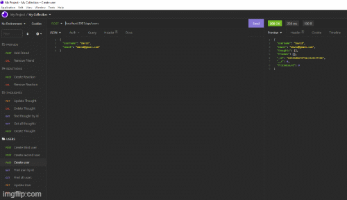
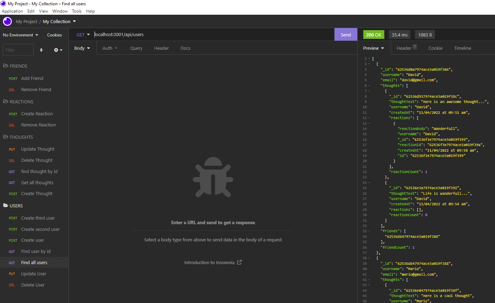
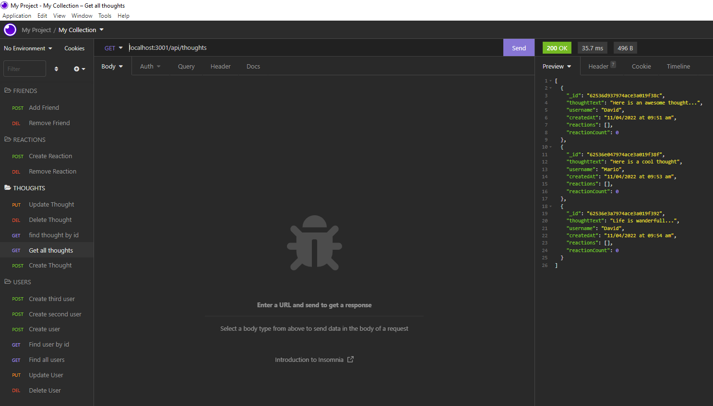
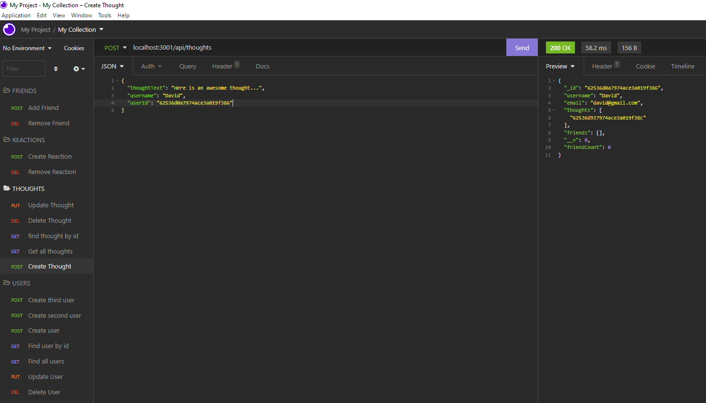
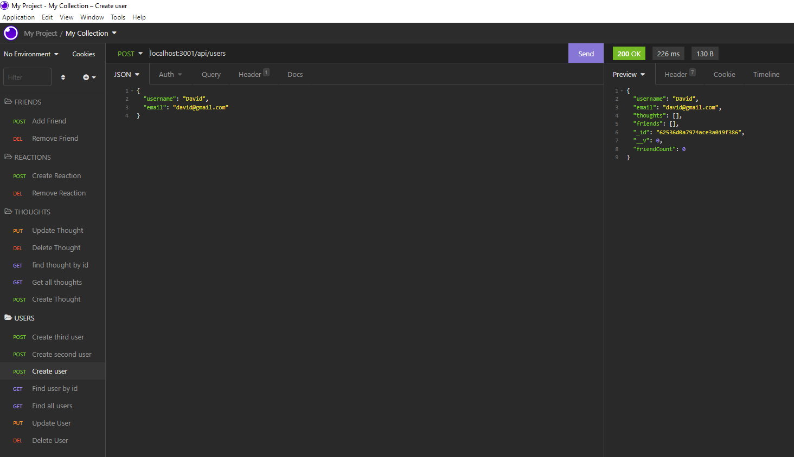

  # Social-Network-API [](https://opensource.org/licenses/MIT)

  ## Description
  Building an API for a social network web application where users can share their thoughts, react to friends’ thoughts, and create a friend list.

  A link to a walkthrough videos demonstrating the functionality of the application [video-1](https://drive.google.com/file/d/15KzvxLbFCs_JeSfDUsQo8Y9xg1C1dxAP/view?usp=sharing) , [video-2](https://drive.google.com/file/d/1SepUn_KYaQ49gRKZNH40uowbq2KujYNq/view?usp=sharing)

   

  ## Tables of Contents
  * [Technologies](#technologies)
  * [User Story](#user-story)
  * [Acceptance Criteria](#acceptance-criteria)
  * [Instalation](#instalation)
  * [Usage](#usage)
  * [License](#license)
  * [Contributing](#contributing)
  * [Tests](#tests)
  * [Questions](#questions)

  ## Technologies

  * Express.js
  * Mongoose
  * Mongoose ODM
  * Datejs Library
  * JavaScript

  ## User Story

```md
AS A social media startup
I WANT an API for my social network that uses a NoSQL database
SO THAT my website can handle large amounts of unstructured data
```

## Acceptance Criteria

```md
GIVEN a social network API
WHEN I enter the command to invoke the application
THEN my server is started and the Mongoose models are synced to the MongoDB database
WHEN I open API GET routes in Insomnia for users and thoughts
THEN the data for each of these routes is displayed in a formatted JSON
WHEN I test API POST, PUT, and DELETE routes in Insomnia
THEN I am able to successfully create, update, and delete users and thoughts in my database
WHEN I test API POST and DELETE routes in Insomnia
THEN I am able to successfully create and delete reactions to thoughts and add and remove friends to a user’s friend list
```
   
  ## Instalation
   
   * Run npm install
   * Run npm start
   * Use Insomnia to test the routes and the CRUD operations

  ## Usage
   
   -Gif:

  

   -Screenshot-1:

  

   -Screenshot-2:

  

   -Screenshot-3:

  

   -Screenshot-4:

  
  
  ## License
   For information about this license visit: [MIT](https://opensource.org/licenses/MIT)

  ## Contributing
   No contribution

  ## Tests
   No test

  ## Questions
  My GitHub link: [Samer-Balee](https://github.com/Samer-Balee)

  If you have any questions, please e-mail me at samerbalee@gmail.com
